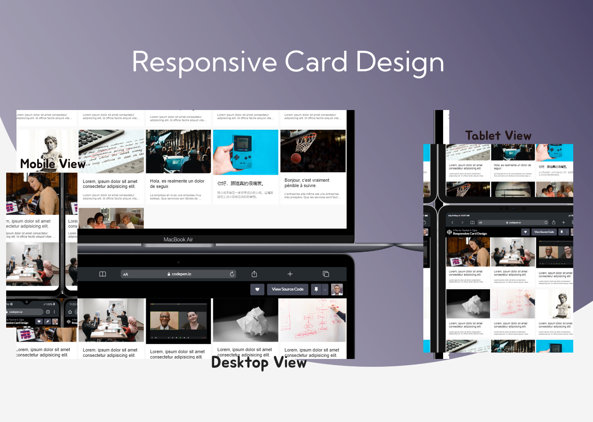

# Responsive Card Design

A simple responsive card design made with HTML and CSS using the CSS Grid property. This project showcases a card component that adapts to various screen sizes, including desktop, tablet, phone, and even smartwatch screens.

## Preview

## Click link below to view  live
[Live preview 💻](https://codepen.io/paxbond01/full/eYQVGyj/live-preview-url)  

 

## GIF Demo

  

    
    
    
  

  

    
    
  

  
## Features

- Responsive layout using CSS Grid
- Adapts to desktop, tablet, phone, and smartwatch screens
- Minimalistic design

## Usage

1. Clone the repository: `git clone https://github.com/apOGBA424/responsive-card-using-grid.git`

2. Navigate to the project directory: `cd responsive-card-using-grid`
3. Open `index.html` in your preferred web browser

## Customization

You can customize the card design by modifying the CSS styles in the `styles.css` file. Feel free to experiment with different colors, fonts, and layouts to fit your project's needs.

## Contributing

Contributions are welcome! If you find any issues or would like to suggest improvements, please open an issue or submit a pull request.

## License

This project is licensed under the [MIT License](https://opensource.org/licenses/MIT).
